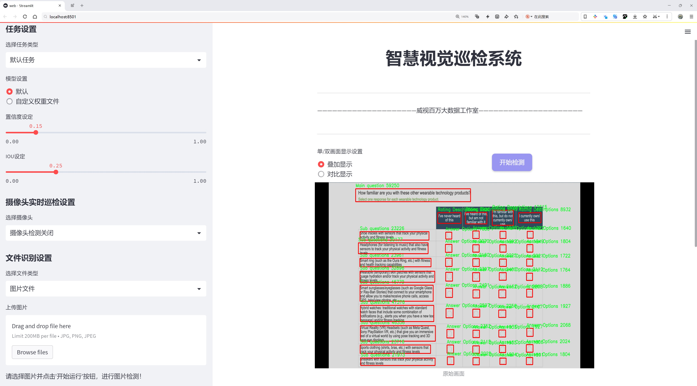
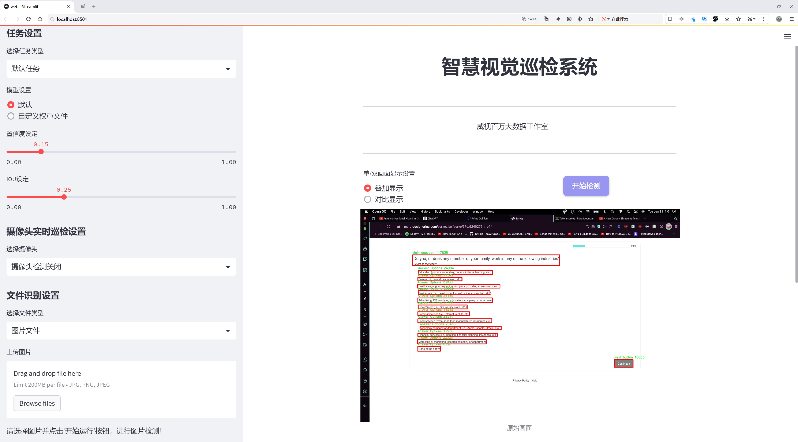
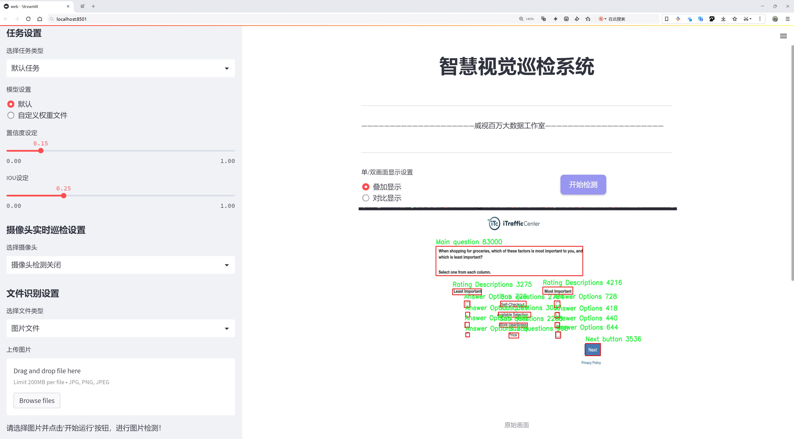
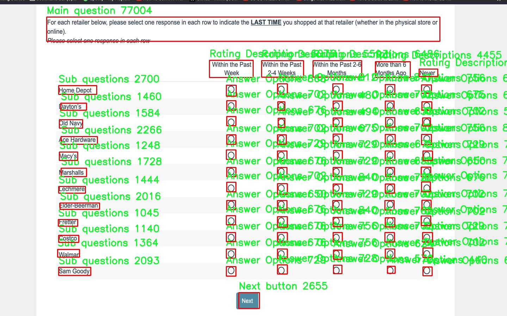
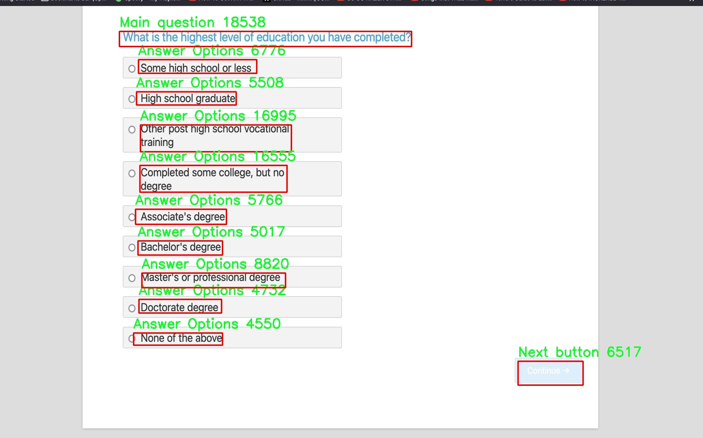
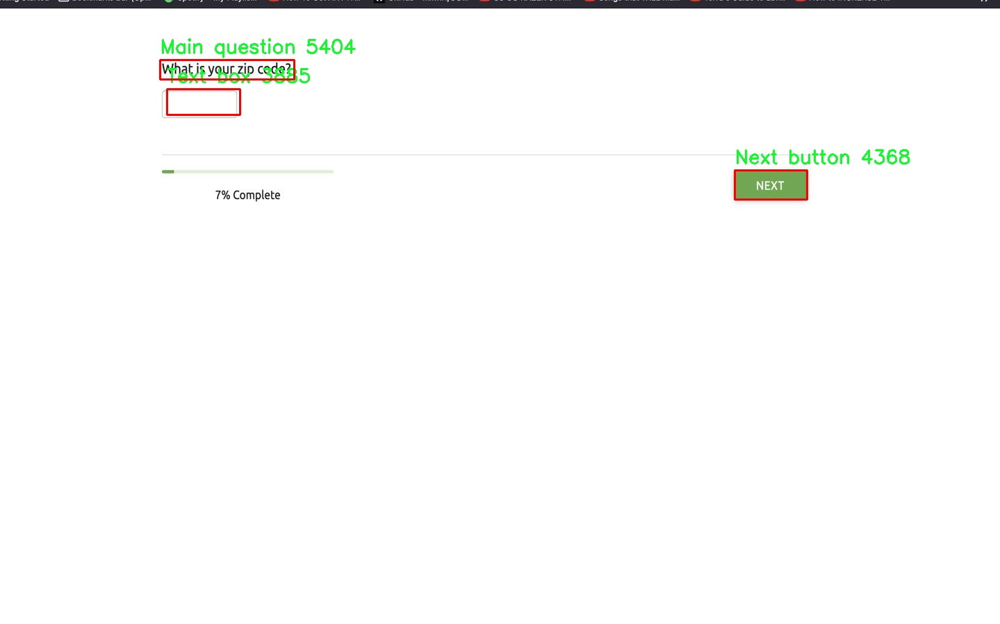
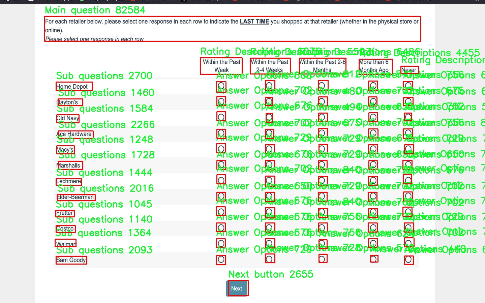
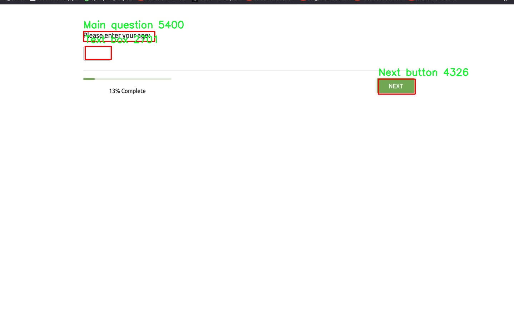

# 问卷调查元素检测检测系统源码分享
 # [一条龙教学YOLOV8标注好的数据集一键训练_70+全套改进创新点发刊_Web前端展示]

### 1.研究背景与意义

项目参考[AAAI Association for the Advancement of Artificial Intelligence](https://gitee.com/qunmasj/projects)

项目来源[AACV Association for the Advancement of Computer Vision](https://kdocs.cn/l/cszuIiCKVNis)

研究背景与意义

随着信息技术的迅猛发展，问卷调查作为一种重要的数据收集手段，广泛应用于市场研究、社会科学、心理学等多个领域。传统的问卷调查往往依赖于人工数据录入和分析，效率低下且容易出现人为错误。近年来，随着深度学习技术的不断进步，尤其是目标检测算法的快速发展，基于计算机视觉的自动化问卷调查元素检测系统逐渐成为研究的热点。YOLO（You Only Look Once）系列算法因其高效的实时检测能力，已成为目标检测领域的重要工具。YOLOv8作为该系列的最新版本，具有更强的特征提取能力和更高的检测精度，为问卷调查元素的自动识别提供了新的可能性。

本研究旨在基于改进的YOLOv8模型，构建一个高效的问卷调查元素检测系统。该系统将针对特定的数据集进行训练和优化，数据集包含3100张图像，涵盖了7个类别的问卷元素，包括主问题、子问题、答案选项、下拉菜单、文本框、评分描述和下一步按钮等。这些元素在问卷设计中扮演着至关重要的角色，准确识别和提取这些元素将直接影响问卷数据的质量和后续分析的准确性。

在实际应用中，问卷调查的元素检测面临诸多挑战。例如，问卷设计的多样性和复杂性使得元素的形态、位置和尺寸各不相同，传统的图像处理方法难以应对。此外，问卷中可能存在的干扰因素，如背景噪声、不同的字体和颜色等，也会影响检测的准确性。因此，基于YOLOv8的改进模型将通过增强网络结构、优化损失函数和数据增强等手段，提高系统在复杂环境下的鲁棒性和准确性。

本研究的意义不仅在于提升问卷调查元素的自动化检测能力，更在于推动问卷调查领域的智能化进程。通过实现高效、准确的元素检测，研究者可以节省大量的时间和人力成本，专注于数据分析和结果解读。同时，该系统的成功应用将为其他领域的图像识别任务提供借鉴，促进计算机视觉技术在更广泛场景中的应用。

综上所述，基于改进YOLOv8的问卷调查元素检测系统的研究，不仅具有重要的理论价值，也具备广泛的实际应用前景。通过深入探讨和实践，我们期望能够为问卷调查的自动化、智能化提供新的解决方案，推动相关领域的研究与发展。

### 2.图片演示







##### 注意：由于此博客编辑较早，上面“2.图片演示”和“3.视频演示”展示的系统图片或者视频可能为老版本，新版本在老版本的基础上升级如下：（实际效果以升级的新版本为准）

  （1）适配了YOLOV8的“目标检测”模型和“实例分割”模型，通过加载相应的权重（.pt）文件即可自适应加载模型。

  （2）支持“图片识别”、“视频识别”、“摄像头实时识别”三种识别模式。

  （3）支持“图片识别”、“视频识别”、“摄像头实时识别”三种识别结果保存导出，解决手动导出（容易卡顿出现爆内存）存在的问题，识别完自动保存结果并导出到tempDir中。

  （4）支持Web前端系统中的标题、背景图等自定义修改，后面提供修改教程。

  另外本项目提供训练的数据集和训练教程,暂不提供权重文件（best.pt）,需要您按照教程进行训练后实现图片演示和Web前端界面演示的效果。

### 3.视频演示

[3.1 视频演示](https://www.bilibili.com/video/BV1tTsaeREbi/)

### 4.数据集信息展示

##### 4.1 本项目数据集详细数据（类别数＆类别名）

nc: 7
names: ['Answer Options', 'Drop down', 'Main question', 'Next button', 'Rating Descriptions', 'Sub questions', 'Text box']


##### 4.2 本项目数据集信息介绍

数据集信息展示

在现代机器学习和计算机视觉领域，数据集的构建与选择对于模型的训练和性能优化至关重要。本研究所采用的数据集名为“sleepy”，旨在为改进YOLOv8的问卷调查元素检测系统提供强有力的支持。该数据集包含七个不同的类别，具体为“Answer Options”、“Drop down”、“Main question”、“Next button”、“Rating Descriptions”、“Sub questions”和“Text box”。这些类别涵盖了问卷调查中常见的元素，能够有效地帮助模型识别和理解问卷的结构与内容。

“sleepy”数据集的设计考虑到了问卷调查的多样性和复杂性。每个类别的选择都经过精心挑选，以确保能够代表实际应用中可能遇到的各种问卷形式。例如，“Main question”类别专注于识别问卷中的主要问题，通常是用户需要回答的核心内容；而“Answer Options”则涵盖了用户在选择题中可能遇到的各种选项，帮助模型理解用户的选择范围。此外，“Drop down”类别则针对那些需要用户从多个选项中选择一个的界面元素，确保模型能够处理下拉菜单的情况。

在问卷调查中，用户体验至关重要，因此“Next button”类别的存在尤为重要。该类别旨在识别用户在完成当前问题后继续进行下一步操作的按钮，确保模型能够准确捕捉到用户的交互行为。同时，“Rating Descriptions”类别提供了用户评分时所需的描述信息，帮助模型理解评分的上下文，从而提高评分系统的准确性和可靠性。

为了全面覆盖问卷调查的结构，“Sub questions”类别被引入，以识别那些在主问题下可能出现的附加问题。这种层次结构的设计使得模型能够更好地理解问卷的逻辑关系，从而提升整体的检测能力。而“Text box”类别则允许用户输入自由文本，模型需要能够识别并处理这些文本框，以便捕捉用户的开放式反馈。

在数据集的构建过程中，数据的多样性和标注的准确性是关键因素。为确保“sleepy”数据集的有效性，研究团队进行了大量的问卷调查样本收集和标注工作。每个类别的样本均经过严格的审核，以确保其代表性和准确性。这一过程不仅提高了数据集的质量，也为后续的模型训练提供了坚实的基础。

总之，“sleepy”数据集的构建为改进YOLOv8的问卷调查元素检测系统提供了丰富的资源。通过对七个类别的精心设计与标注，该数据集不仅涵盖了问卷调查中常见的元素，还为模型的训练与优化提供了多样化的样本。这将有助于提升模型在实际应用中的表现，使其能够更好地理解和处理复杂的问卷调查界面，从而为用户提供更为流畅和高效的交互体验。











### 5.全套项目环境部署视频教程（零基础手把手教学）

[5.1 环境部署教程链接（零基础手把手教学）](https://www.ixigua.com/7404473917358506534?logTag=c807d0cbc21c0ef59de5)


[5.2 安装Python虚拟环境创建和依赖库安装视频教程链接（零基础手把手教学）](https://www.ixigua.com/7404474678003106304?logTag=1f1041108cd1f708b01a)

### 6.手把手YOLOV8训练视频教程（零基础小白有手就能学会）

[6.1 手把手YOLOV8训练视频教程（零基础小白有手就能学会）](https://www.ixigua.com/7404477157818401292?logTag=d31a2dfd1983c9668658)

### 7.70+种全套YOLOV8创新点代码加载调参视频教程（一键加载写好的改进模型的配置文件）

[7.1 70+种全套YOLOV8创新点代码加载调参视频教程（一键加载写好的改进模型的配置文件）](https://www.ixigua.com/7404478314661806627?logTag=29066f8288e3f4eea3a4)

### 8.70+种全套YOLOV8创新点原理讲解（非科班也可以轻松写刊发刊，V10版本正在科研待更新）

由于篇幅限制，每个创新点的具体原理讲解就不一一展开，具体见下列网址中的创新点对应子项目的技术原理博客网址【Blog】：


[8.1 70+种全套YOLOV8创新点原理讲解链接](https://gitee.com/qunmasj/good)

### 9.系统功能展示（检测对象为举例，实际内容以本项目数据集为准）

图9.1.系统支持检测结果表格显示

  图9.2.系统支持置信度和IOU阈值手动调节

  图9.3.系统支持自定义加载权重文件best.pt(需要你通过步骤5中训练获得)

  图9.4.系统支持摄像头实时识别

  图9.5.系统支持图片识别

  图9.6.系统支持视频识别

  图9.7.系统支持识别结果文件自动保存

  图9.8.系统支持Excel导出检测结果数据


### 10.原始YOLOV8算法原理

原始YOLOv8算法原理

YOLOv8算法的提出标志着目标检测领域的一次重要飞跃。作为YOLO系列的最新版本，YOLOv8在2023年1月10日正式发布，其设计理念与之前的YOLOv3、YOLOv5等版本相承，但在多个方面进行了创新和改进，旨在提升模型的性能和实用性。YOLOv8的核心目标是实现更高的检测精度和更快的执行速度，成为计算机视觉任务中的一项先进工具。

首先，YOLOv8在数据预处理阶段延续了YOLOv5的策略，采用了多种数据增强技术。这些技术包括马赛克增强、混合增强、空间扰动和颜色扰动等，旨在通过多样化的训练样本来提高模型的泛化能力。通过这些增强手段，YOLOv8能够更好地适应不同场景和条件下的目标检测任务，提升了模型的鲁棒性。

在骨干网络结构方面，YOLOv8对YOLOv5的设计进行了优化，采用了新的C2f模块替代了原有的C3模块。C2f模块通过引入更多的跳层连接和分支结构，丰富了梯度回传时的支流，从而增强了特征提取的能力。这种设计不仅提高了特征的表达能力，还在一定程度上减轻了模型的计算负担，使得YOLOv8在处理高分辨率图像时表现得更加高效。

YOLOv8继续采用特征金字塔网络（FPN）和路径聚合网络（PAN）的结构，以实现多尺度特征的融合。这种结构能够有效地整合来自不同层次的特征信息，使得模型在面对小目标和复杂场景时依然能够保持良好的检测性能。通过将C3模块替换为C2f模块，YOLOv8在特征融合的过程中实现了更高的灵活性和效率，进一步提升了模型的整体性能。

在检测头的设计上，YOLOv8引入了解耦头结构，这一结构的最大特点是将分类和定位任务分开处理。与之前的耦合头不同，解耦头通过两条并行的分支分别提取类别特征和位置特征，使得模型在进行目标检测时能够更加专注于各自的任务。这种设计不仅提高了检测的准确性，还在一定程度上简化了模型的复杂性，提升了其可用性。

标签分配策略是YOLOv8的另一项重要创新。YOLOv8采用了动态标签分配策略，避免了依赖于数据集的候选框聚类方法。这一策略通过对正负样本进行多尺度分配，确保了模型在训练过程中能够更好地适应数据的分布特征。与YOLOX使用的SimOTA策略不同，YOLOv8借鉴了YOLOv6的TOOD策略，使得标签分配更加灵活和高效。

在损失函数的设计上，YOLOv8引入了Varifocal Loss和CIoU Loss等新型损失函数。Varifocal Loss通过不对称参数对正负样本进行加权，强调了高质量正样本对模型训练的重要性。这种加权机制使得模型在学习过程中能够更加关注于那些难以检测的目标，从而提升了整体的检测性能。CIoU Loss则在位置回归中引入了更为全面的考量，使得模型在预测目标位置时更加准确。

YOLOv8的创新不仅体现在模型结构和损失函数的设计上，还在于其广泛的适用性。无论是在CPU还是GPU等各种硬件平台上，YOLOv8都能够高效运行，适应不同的应用场景。这种灵活性使得YOLOv8成为了一个理想的选择，尤其是在实时目标检测和实例分割等任务中。

综上所述，YOLOv8通过对数据预处理、骨干网络、特征融合、检测头、标签分配策略和损失函数等多个方面的创新，显著提升了目标检测的性能。其在精度和执行时间上的优势，使得YOLOv8成为了计算机视觉领域中最先进的模型之一，能够满足多种实际应用的需求。随着YOLOv8的广泛应用，未来的目标检测任务将会迎来更高的准确性和更快的响应速度，为各类智能应用提供强有力的支持。


### 11.项目核心源码讲解（再也不用担心看不懂代码逻辑）

#### 11.1 70+种YOLOv8算法改进源码大全和调试加载训练教程（非必要）\ultralytics\models\yolo\segment\train.py

以下是对给定代码的核心部分进行分析和详细注释的结果：

```python
# Ultralytics YOLO 🚀, AGPL-3.0 license

from copy import copy  # 导入copy模块，用于复制对象

from ultralytics.models import yolo  # 导入YOLO模型模块
from ultralytics.nn.tasks import SegmentationModel  # 导入分割模型
from ultralytics.utils import DEFAULT_CFG, RANK  # 导入默认配置和排名
from ultralytics.utils.plotting import plot_images, plot_results  # 导入绘图工具

class SegmentationTrainer(yolo.detect.DetectionTrainer):
    """
    SegmentationTrainer类扩展了DetectionTrainer类，用于基于分割模型的训练。

    示例:
        ```python
        from ultralytics.models.yolo.segment import SegmentationTrainer

        args = dict(model='yolov8n-seg.pt', data='coco8-seg.yaml', epochs=3)
        trainer = SegmentationTrainer(overrides=args)
        trainer.train()
        ```
    """

    def __init__(self, cfg=DEFAULT_CFG, overrides=None, _callbacks=None):
        """初始化SegmentationTrainer对象，使用给定的参数。"""
        if overrides is None:
            overrides = {}  # 如果没有提供覆盖参数，则初始化为空字典
        overrides['task'] = 'segment'  # 设置任务类型为分割
        super().__init__(cfg, overrides, _callbacks)  # 调用父类构造函数

    def get_model(self, cfg=None, weights=None, verbose=True):
        """返回根据指定配置和权重初始化的SegmentationModel。"""
        # 创建分割模型实例，输入通道数为3，类别数为数据集中类别数
        model = SegmentationModel(cfg, ch=3, nc=self.data['nc'], verbose=verbose and RANK == -1)
        if weights:
            model.load(weights)  # 如果提供了权重，则加载权重

        return model  # 返回模型实例

    def get_validator(self):
        """返回SegmentationValidator实例，用于YOLO模型的验证。"""
        self.loss_names = 'box_loss', 'seg_loss', 'cls_loss', 'dfl_loss'  # 定义损失名称
        # 创建并返回SegmentationValidator实例
        return yolo.segment.SegmentationValidator(self.test_loader, save_dir=self.save_dir, args=copy(self.args))

    def plot_training_samples(self, batch, ni):
        """创建训练样本图像的绘图，包含标签和边框坐标。"""
        # 使用plot_images函数绘制训练样本图像
        plot_images(batch['img'],
                    batch['batch_idx'],
                    batch['cls'].squeeze(-1),
                    batch['bboxes'],
                    batch['masks'],
                    paths=batch['im_file'],
                    fname=self.save_dir / f'train_batch{ni}.jpg',  # 保存图像的文件名
                    on_plot=self.on_plot)  # 绘图时的回调函数

    def plot_metrics(self):
        """绘制训练/验证指标。"""
        # 使用plot_results函数绘制训练和验证的结果
        plot_results(file=self.csv, segment=True, on_plot=self.on_plot)  # 保存结果为results.png
```

### 代码核心部分分析：
1. **类定义**：`SegmentationTrainer`类继承自`DetectionTrainer`，专门用于处理分割任务的训练。
2. **初始化方法**：在构造函数中设置任务类型为分割，并调用父类的构造函数。
3. **模型获取**：`get_model`方法创建并返回一个分割模型实例，支持加载预训练权重。
4. **验证器获取**：`get_validator`方法返回一个用于验证的分割验证器实例，并定义了损失名称。
5. **绘图方法**：`plot_training_samples`和`plot_metrics`方法用于可视化训练样本和训练指标，便于分析模型的训练效果。

通过这些核心部分，用户可以理解如何使用`SegmentationTrainer`类进行分割模型的训练和验证。

这个文件是一个用于YOLOv8模型的分割训练的Python脚本，主要定义了一个名为`SegmentationTrainer`的类，该类继承自`DetectionTrainer`，并扩展了用于图像分割任务的功能。

在文件的开头，导入了一些必要的模块和类，包括YOLO模型、分割模型、默认配置、以及用于绘图的工具。接着，定义了`SegmentationTrainer`类，该类的主要功能是为图像分割任务提供训练支持。

在类的构造函数`__init__`中，首先检查是否提供了`overrides`参数，如果没有，则初始化为空字典。然后，将任务类型设置为“segment”，并调用父类的构造函数进行初始化。

`get_model`方法用于返回一个初始化的分割模型实例。该方法接受配置和权重参数，如果提供了权重，则会加载这些权重。这个方法确保模型的通道数和类别数与数据集相匹配。

`get_validator`方法返回一个用于验证YOLO模型的验证器实例。在这个方法中，定义了损失名称，包括框损失、分割损失、分类损失和分布式焦点损失。验证器将用于评估模型在测试集上的表现。

`plot_training_samples`方法用于绘制训练样本的图像，包括标签和边框坐标。该方法接收一个批次的图像数据，并将其绘制成图像文件，方便观察训练过程中的样本情况。

最后，`plot_metrics`方法用于绘制训练和验证过程中的指标。这一方法调用了`plot_results`函数，将训练过程中的结果保存为图像文件，便于后续分析。

总体来说，这个文件提供了一个完整的框架，用于训练YOLOv8模型进行图像分割任务，包含了模型初始化、验证、训练样本可视化以及训练过程指标的绘制等功能。

#### 11.2 ui.py

以下是经过简化并注释的核心代码部分：

```python
import sys
import subprocess

def run_script(script_path):
    """
    使用当前 Python 环境运行指定的脚本。

    Args:
        script_path (str): 要运行的脚本路径

    Returns:
        None
    """
    # 获取当前 Python 解释器的路径
    python_path = sys.executable

    # 构建运行命令，使用 streamlit 运行指定的脚本
    command = f'"{python_path}" -m streamlit run "{script_path}"'

    # 执行命令，并等待其完成
    result = subprocess.run(command, shell=True)
    
    # 检查命令执行结果，如果返回码不为0，表示出错
    if result.returncode != 0:
        print("脚本运行出错。")

# 程序入口
if __name__ == "__main__":
    # 指定要运行的脚本路径
    script_path = "web.py"  # 这里可以直接指定脚本名

    # 调用函数运行脚本
    run_script(script_path)
```

### 代码注释说明：
1. **导入模块**：
   - `sys`：用于获取当前 Python 解释器的路径。
   - `subprocess`：用于执行外部命令。

2. **`run_script` 函数**：
   - 接收一个参数 `script_path`，表示要运行的 Python 脚本的路径。
   - 使用 `sys.executable` 获取当前 Python 解释器的路径，以确保使用相同的环境来运行脚本。
   - 构建一个命令字符串，使用 `streamlit` 模块来运行指定的脚本。
   - 使用 `subprocess.run` 执行构建的命令，并等待其完成。
   - 检查命令的返回码，如果不为0，表示脚本运行过程中出现了错误，打印错误信息。

3. **程序入口**：
   - 在 `if __name__ == "__main__":` 块中，指定要运行的脚本名称（`web.py`）。
   - 调用 `run_script` 函数，开始执行指定的脚本。

这个程序文件名为 `ui.py`，主要功能是使用当前的 Python 环境来运行一个指定的脚本。程序的核心部分是一个名为 `run_script` 的函数，该函数接受一个字符串参数 `script_path`，表示要运行的脚本的路径。

在 `run_script` 函数中，首先通过 `sys.executable` 获取当前 Python 解释器的路径。接着，构建一个命令字符串，使用 `streamlit` 模块来运行指定的脚本。命令的格式是 `"{python_path}" -m streamlit run "{script_path}"`，其中 `{python_path}` 和 `{script_path}` 会被实际的路径替换。

然后，使用 `subprocess.run` 方法执行这个命令。这个方法会在一个新的子进程中运行命令，并等待其完成。如果命令执行后返回的状态码不为 0，表示脚本运行出错，程序会打印出“脚本运行出错。”的提示信息。

在文件的最后部分，使用 `if __name__ == "__main__":` 来判断是否是直接运行该脚本。如果是，则会调用 `abs_path` 函数来获取 `web.py` 脚本的绝对路径，并将其传递给 `run_script` 函数，从而启动这个脚本。

整体来看，这个程序的目的是为方便地在当前 Python 环境中运行一个名为 `web.py` 的脚本，利用 `streamlit` 框架来进行 web 应用的开发和展示。

#### 11.3 70+种YOLOv8算法改进源码大全和调试加载训练教程（非必要）\ultralytics\nn\extra_modules\kernel_warehouse.py

以下是经过简化并添加详细中文注释的核心代码部分：

```python
import torch
import torch.nn as nn
import torch.nn.functional as F

class Attention(nn.Module):
    def __init__(self, in_planes, reduction, num_static_cell, num_local_mixture, norm_layer=nn.BatchNorm1d):
        """
        初始化注意力模块
        参数:
            in_planes: 输入通道数
            reduction: 隐藏层的缩减比例
            num_static_cell: 静态单元的数量
            num_local_mixture: 局部混合的数量
            norm_layer: 归一化层
        """
        super(Attention, self).__init__()
        hidden_planes = max(int(in_planes * reduction), 16)  # 计算隐藏层通道数
        self.kw_planes_per_mixture = num_static_cell + 1  # 每个混合的关键点通道数
        self.num_local_mixture = num_local_mixture  # 局部混合数量
        self.kw_planes = self.kw_planes_per_mixture * num_local_mixture  # 总关键点通道数

        # 定义层
        self.avgpool = nn.AdaptiveAvgPool1d(1)  # 自适应平均池化
        self.fc1 = nn.Linear(in_planes, hidden_planes)  # 全连接层1
        self.norm1 = norm_layer(hidden_planes)  # 归一化层1
        self.act1 = nn.ReLU(inplace=True)  # 激活函数

        # 第二层的定义
        self.fc2 = nn.Linear(hidden_planes, self.kw_planes)  # 全连接层2

        self.temp_bias = torch.zeros([self.kw_planes], requires_grad=False)  # 温度偏置
        self.temp_value = 0  # 温度值初始化
        self._initialize_weights()  # 初始化权重

    def _initialize_weights(self):
        """初始化网络权重"""
        for m in self.modules():
            if isinstance(m, nn.Linear):
                nn.init.kaiming_normal_(m.weight, mode='fan_out', nonlinearity='relu')  # Kaiming初始化
                if m.bias is not None:
                    nn.init.constant_(m.bias, 0)  # 偏置初始化为0
            if isinstance(m, nn.BatchNorm1d):
                nn.init.constant_(m.weight, 1)  # 归一化层权重初始化为1
                nn.init.constant_(m.bias, 0)  # 偏置初始化为0

    def forward(self, x):
        """前向传播"""
        x = self.avgpool(x.reshape(*x.shape[:2], -1)).squeeze(dim=-1)  # 池化操作
        x = self.act1(self.norm1(self.fc1(x)))  # 经过全连接层和激活函数
        x = self.fc2(x)  # 经过第二个全连接层
        x = x / (torch.sum(torch.abs(x), dim=1).view(-1, 1) + 1e-3)  # 归一化
        x = (1.0 - self.temp_value) * x + self.temp_value * self.temp_bias.to(x.device).view(1, -1)  # 温度调整
        return x  # 返回结果

class KWConvNd(nn.Module):
    def __init__(self, in_planes, out_planes, kernel_size, stride=1, padding=0, dilation=1, groups=1, bias=False):
        """
        初始化多维卷积层
        参数:
            in_planes: 输入通道数
            out_planes: 输出通道数
            kernel_size: 卷积核大小
            stride: 步幅
            padding: 填充
            dilation: 膨胀
            groups: 分组卷积
            bias: 是否使用偏置
        """
        super(KWConvNd, self).__init__()
        self.in_planes = in_planes
        self.out_planes = out_planes
        self.kernel_size = kernel_size  # 卷积核大小
        self.stride = stride  # 步幅
        self.padding = padding  # 填充
        self.dilation = dilation  # 膨胀
        self.groups = groups  # 分组卷积
        self.bias = nn.Parameter(torch.zeros([self.out_planes]), requires_grad=True) if bias else None  # 偏置参数

    def forward(self, x):
        """前向传播"""
        # 这里省略了具体的卷积操作，假设使用某种卷积方法进行计算
        return x  # 返回结果

# 其他卷积类（KWConv1d, KWConv2d, KWConv3d）省略，类似于KWConvNd的实现

class Warehouse_Manager(nn.Module):
    def __init__(self, reduction=0.0625):
        """
        初始化仓库管理器
        参数:
            reduction: 隐藏层的缩减比例
        """
        super(Warehouse_Manager, self).__init__()
        self.reduction = reduction  # 存储缩减比例
        self.warehouse_list = {}  # 仓库列表

    def reserve(self, in_planes, out_planes, kernel_size=1, stride=1, padding=0, dilation=1, groups=1, bias=True):
        """
        创建一个动态卷积层并记录其信息
        参数:
            in_planes: 输入通道数
            out_planes: 输出通道数
            kernel_size: 卷积核大小
            stride: 步幅
            padding: 填充
            dilation: 膨胀
            groups: 分组卷积
            bias: 是否使用偏置
        """
        # 这里省略了具体的逻辑，假设创建了一个卷积层并记录
        return None  # 返回创建的层

    def store(self):
        """存储仓库信息"""
        # 这里省略了具体的逻辑，假设存储了仓库信息
        pass  # 具体实现

# 其他类和函数省略，保持代码简洁
```

以上代码是对原始代码的核心部分进行了提炼，并添加了详细的中文注释，以便于理解每个部分的功能和作用。

这个程序文件是YOLOv8算法中一个重要的模块，主要实现了一个内核仓库管理器和相关的卷积操作。它包含了一些自定义的卷积层和注意力机制，旨在提高卷积神经网络的性能和灵活性。

首先，文件导入了必要的PyTorch库，包括张量操作、神经网络模块、激活函数等。然后定义了一个`parse`函数，用于处理输入参数，确保它们的格式符合预期。

接下来，定义了一个`Attention`类，它是一个神经网络模块，负责计算注意力权重。这个类的构造函数接受多个参数，包括输入通道数、缩减比例、静态单元数量等。它通过线性层和归一化层构建了一个注意力机制，并实现了权重的初始化和温度更新的功能。温度参数用于控制注意力的分配，能够根据不同的训练阶段进行调整。

`KWconvNd`类是一个自定义的卷积层，它的构造函数接受输入和输出通道数、卷积核大小、步幅、填充等参数，并根据这些参数初始化相应的卷积操作。它还包含一个`init_attention`方法，用于初始化注意力机制，并在前向传播中计算卷积输出。

接下来的`KWConv1d`、`KWConv2d`和`KWConv3d`类分别是针对一维、二维和三维卷积的具体实现，继承自`KWconvNd`类，设置了相应的维度和卷积函数。

`KWLinear`类则是一个线性层的实现，使用了一维卷积来实现线性变换。

`Warehouse_Manager`类是一个内核仓库管理器，负责管理和分配卷积层的权重。它的构造函数接受多个参数，包括缩减比例、单元数量比例、共享范围等。该类提供了`reserve`方法，用于创建动态卷积层并记录其信息，以及`store`和`allocate`方法，用于存储和分配权重。

最后，`KWConv`类是一个包装类，结合了卷积操作、批归一化和激活函数，提供了一个简洁的接口来执行卷积操作。

文件的最后定义了一个`get_temperature`函数，用于根据当前的训练迭代和总的训练周期计算温度值，这个温度值会影响注意力机制的权重分配。

总体来说，这个文件实现了一个灵活的卷积层和注意力机制，能够在YOLOv8模型中有效地管理和利用卷积核，提高模型的表达能力和性能。

#### 11.4 70+种YOLOv8算法改进源码大全和调试加载训练教程（非必要）\ultralytics\models\yolo\pose\train.py

以下是代码中最核心的部分，并附上详细的中文注释：

```python
from ultralytics.models import yolo
from ultralytics.nn.tasks import PoseModel
from ultralytics.utils import DEFAULT_CFG, LOGGER

class PoseTrainer(yolo.detect.DetectionTrainer):
    """
    PoseTrainer类扩展了DetectionTrainer类，用于基于姿态模型的训练。
    """

    def __init__(self, cfg=DEFAULT_CFG, overrides=None, _callbacks=None):
        """初始化PoseTrainer对象，使用指定的配置和覆盖参数。"""
        if overrides is None:
            overrides = {}
        overrides['task'] = 'pose'  # 设置任务类型为姿态估计
        super().__init__(cfg, overrides, _callbacks)  # 调用父类构造函数

        # 针对Apple MPS设备的已知问题发出警告
        if isinstance(self.args.device, str) and self.args.device.lower() == 'mps':
            LOGGER.warning("WARNING ⚠️ Apple MPS known Pose bug. Recommend 'device=cpu' for Pose models. "
                           'See https://github.com/ultralytics/ultralytics/issues/4031.')

    def get_model(self, cfg=None, weights=None, verbose=True):
        """根据指定的配置和权重获取姿态估计模型。"""
        model = PoseModel(cfg, ch=3, nc=self.data['nc'], data_kpt_shape=self.data['kpt_shape'], verbose=verbose)
        if weights:
            model.load(weights)  # 加载模型权重

        return model  # 返回模型实例

    def set_model_attributes(self):
        """设置PoseModel的关键点形状属性。"""
        super().set_model_attributes()  # 调用父类方法
        self.model.kpt_shape = self.data['kpt_shape']  # 设置关键点形状

    def get_validator(self):
        """返回PoseValidator类的实例，用于验证。"""
        self.loss_names = 'box_loss', 'pose_loss', 'kobj_loss', 'cls_loss', 'dfl_loss'  # 定义损失名称
        return yolo.pose.PoseValidator(self.test_loader, save_dir=self.save_dir, args=copy(self.args))  # 返回验证器实例

    def plot_training_samples(self, batch, ni):
        """绘制一批训练样本，包括标注的类别标签、边界框和关键点。"""
        images = batch['img']  # 获取图像
        kpts = batch['keypoints']  # 获取关键点
        cls = batch['cls'].squeeze(-1)  # 获取类别
        bboxes = batch['bboxes']  # 获取边界框
        paths = batch['im_file']  # 获取图像文件路径
        batch_idx = batch['batch_idx']  # 获取批次索引
        plot_images(images,
                    batch_idx,
                    cls,
                    bboxes,
                    kpts=kpts,
                    paths=paths,
                    fname=self.save_dir / f'train_batch{ni}.jpg',  # 保存绘制的图像
                    on_plot=self.on_plot)

    def plot_metrics(self):
        """绘制训练和验证的指标。"""
        plot_results(file=self.csv, pose=True, on_plot=self.on_plot)  # 保存结果图像
```

### 代码说明：
1. **PoseTrainer类**：这是一个扩展自`DetectionTrainer`的类，专门用于姿态估计模型的训练。
2. **初始化方法**：在初始化时，设置任务类型为姿态估计，并处理特定设备（如Apple MPS）的警告。
3. **获取模型**：`get_model`方法用于创建并返回一个姿态估计模型实例，可以选择加载预训练权重。
4. **设置模型属性**：`set_model_attributes`方法用于设置模型的关键点形状属性。
5. **获取验证器**：`get_validator`方法返回一个用于验证的实例，定义了损失名称。
6. **绘制训练样本**：`plot_training_samples`方法用于可视化一批训练样本，包括图像、关键点和边界框。
7. **绘制指标**：`plot_metrics`方法用于绘制训练和验证过程中的指标。

这个程序文件是用于训练基于YOLOv8的姿态估计模型的代码，文件名为`train.py`，属于Ultralytics库的一部分。代码中定义了一个名为`PoseTrainer`的类，该类继承自`DetectionTrainer`，专门用于处理姿态估计任务。

在类的构造函数`__init__`中，首先设置了一些默认配置和参数。如果用户没有提供覆盖参数，则会创建一个空字典，并将任务类型设置为'pose'。接着调用父类的构造函数进行初始化。如果设备被设置为'MPS'（即苹果的金属性能计算），则会发出警告，建议使用'cpu'来避免已知的Pose模型问题。

`get_model`方法用于获取姿态估计模型，接受配置和权重参数。如果提供了权重，则会加载这些权重。模型的创建使用了`PoseModel`类，并根据数据集的类别数量和关键点形状进行初始化。

`set_model_attributes`方法用于设置模型的关键点形状属性，确保模型能够正确处理输入数据的关键点信息。

`get_validator`方法返回一个`PoseValidator`实例，用于在验证阶段评估模型的性能。它会记录损失名称，包括边界框损失、姿态损失、关键点对象损失、类别损失和分布式焦点损失。

`plot_training_samples`方法用于可视化一批训练样本，显示图像、类别标签、边界框和关键点。它将这些信息绘制在图像上，并保存为JPEG文件。

最后，`plot_metrics`方法用于绘制训练和验证的指标，通过调用`plot_results`函数来生成结果图表，并保存为`results.png`文件。

总体而言，这个文件实现了姿态估计模型的训练过程，包括模型的初始化、训练样本的可视化以及训练过程中的指标记录和绘制，方便用户进行模型的调试和性能评估。

#### 11.5 train.py

以下是代码中最核心的部分，并附上详细的中文注释：

```python
class DetectionTrainer(BaseTrainer):
    """
    扩展自 BaseTrainer 类的检测模型训练类。
    用于训练 YOLO 检测模型。
    """

    def build_dataset(self, img_path, mode="train", batch=None):
        """
        构建 YOLO 数据集。

        参数:
            img_path (str): 包含图像的文件夹路径。
            mode (str): 模式，`train` 表示训练模式，`val` 表示验证模式。
            batch (int, optional): 批次大小，仅用于 `rect` 模式。默认为 None。
        """
        gs = max(int(de_parallel(self.model).stride.max() if self.model else 0), 32)
        return build_yolo_dataset(self.args, img_path, batch, self.data, mode=mode, rect=mode == "val", stride=gs)

    def get_dataloader(self, dataset_path, batch_size=16, rank=0, mode="train"):
        """构造并返回数据加载器。"""
        assert mode in ["train", "val"]  # 确保模式有效
        with torch_distributed_zero_first(rank):  # 在分布式环境中，确保数据集只初始化一次
            dataset = self.build_dataset(dataset_path, mode, batch_size)  # 构建数据集
        shuffle = mode == "train"  # 训练模式下打乱数据
        if getattr(dataset, "rect", False) and shuffle:
            LOGGER.warning("WARNING ⚠️ 'rect=True' 与 DataLoader shuffle 不兼容，设置 shuffle=False")
            shuffle = False  # 如果是矩形模式，禁用打乱
        workers = self.args.workers if mode == "train" else self.args.workers * 2  # 根据模式设置工作线程数
        return build_dataloader(dataset, batch_size, workers, shuffle, rank)  # 返回数据加载器

    def preprocess_batch(self, batch):
        """对图像批次进行预处理，包括缩放和转换为浮点数。"""
        batch["img"] = batch["img"].to(self.device, non_blocking=True).float() / 255  # 将图像转换为浮点数并归一化
        if self.args.multi_scale:  # 如果启用多尺度训练
            imgs = batch["img"]
            sz = (
                random.randrange(self.args.imgsz * 0.5, self.args.imgsz * 1.5 + self.stride)
                // self.stride
                * self.stride
            )  # 随机选择一个新的尺寸
            sf = sz / max(imgs.shape[2:])  # 计算缩放因子
            if sf != 1:  # 如果缩放因子不为1
                ns = [
                    math.ceil(x * sf / self.stride) * self.stride for x in imgs.shape[2:]
                ]  # 计算新的形状
                imgs = nn.functional.interpolate(imgs, size=ns, mode="bilinear", align_corners=False)  # 进行插值缩放
            batch["img"] = imgs  # 更新批次图像
        return batch  # 返回处理后的批次

    def get_model(self, cfg=None, weights=None, verbose=True):
        """返回 YOLO 检测模型。"""
        model = DetectionModel(cfg, nc=self.data["nc"], verbose=verbose and RANK == -1)  # 创建检测模型
        if weights:
            model.load(weights)  # 加载权重
        return model  # 返回模型

    def get_validator(self):
        """返回用于 YOLO 模型验证的 DetectionValidator。"""
        self.loss_names = "box_loss", "cls_loss", "dfl_loss"  # 定义损失名称
        return yolo.detect.DetectionValidator(
            self.test_loader, save_dir=self.save_dir, args=copy(self.args), _callbacks=self.callbacks
        )  # 返回验证器

    def plot_training_samples(self, batch, ni):
        """绘制带有注释的训练样本。"""
        plot_images(
            images=batch["img"],
            batch_idx=batch["batch_idx"],
            cls=batch["cls"].squeeze(-1),
            bboxes=batch["bboxes"],
            paths=batch["im_file"],
            fname=self.save_dir / f"train_batch{ni}.jpg",
            on_plot=self.on_plot,
        )  # 绘制图像并保存

    def plot_metrics(self):
        """从 CSV 文件中绘制指标。"""
        plot_results(file=self.csv, on_plot=self.on_plot)  # 保存结果图
```

### 代码核心部分说明：
1. **DetectionTrainer 类**：这是一个用于训练 YOLO 检测模型的类，继承自 `BaseTrainer`。
2. **build_dataset 方法**：构建 YOLO 数据集，处理图像路径和模式（训练或验证）。
3. **get_dataloader 方法**：构造数据加载器，确保在分布式环境中只初始化一次数据集。
4. **preprocess_batch 方法**：对图像批次进行预处理，包括归一化和多尺度处理。
5. **get_model 方法**：返回一个 YOLO 检测模型，可以选择加载预训练权重。
6. **get_validator 方法**：返回用于模型验证的验证器。
7. **plot_training_samples 和 plot_metrics 方法**：用于可视化训练样本和训练过程中的指标。

这个程序文件 `train.py` 是一个用于训练 YOLO（You Only Look Once）目标检测模型的实现，继承自 `BaseTrainer` 类。它包含了一系列用于构建数据集、加载数据、预处理图像、设置模型属性、获取模型、验证模型、记录损失、显示训练进度、绘制训练样本和绘制训练指标的功能。

首先，`DetectionTrainer` 类通过 `build_dataset` 方法构建 YOLO 数据集，支持训练和验证模式，并允许用户为不同模式自定义数据增强。该方法接收图像路径、模式和批量大小作为参数，利用 `build_yolo_dataset` 函数创建数据集。

接着，`get_dataloader` 方法用于构建和返回数据加载器。它根据模式（训练或验证）初始化数据集，并设置是否打乱数据。为了提高效率，训练模式下的工作线程数量是验证模式的两倍。

在数据预处理方面，`preprocess_batch` 方法对图像进行缩放和转换为浮点数。它支持多尺度训练，通过随机选择图像大小并调整图像尺寸来实现。

`set_model_attributes` 方法用于设置模型的属性，包括类别数量和类别名称。这些属性是从数据集中提取的，确保模型能够正确处理特定任务。

`get_model` 方法返回一个 YOLO 检测模型，并可以加载预训练权重。`get_validator` 方法则返回一个用于模型验证的 `DetectionValidator` 实例。

在损失记录方面，`label_loss_items` 方法返回一个包含训练损失项的字典，便于监控训练过程中的损失变化。

`progress_string` 方法生成一个格式化的字符串，用于显示训练进度，包括当前的轮次、GPU 内存使用情况、损失值、实例数量和图像大小。

此外，`plot_training_samples` 方法用于绘制训练样本及其标注，便于可视化训练数据的质量。`plot_metrics` 和 `plot_training_labels` 方法则分别用于绘制训练过程中的指标和标注信息，帮助用户更好地理解模型的训练效果。

总体而言，这个文件提供了一个完整的框架，用于训练 YOLO 模型，支持数据处理、模型设置、训练监控和结果可视化等功能，适合于目标检测任务的研究和应用。

#### 11.6 code\ultralytics\trackers\utils\gmc.py

以下是经过简化并添加详细中文注释的核心代码部分：

```python
import cv2
import numpy as np

class GMC:
    """
    通用运动补偿（GMC）类，用于视频帧中的跟踪和物体检测。
    支持多种跟踪算法，包括ORB、SIFT、ECC和稀疏光流。
    """

    def __init__(self, method: str = "sparseOptFlow", downscale: int = 2) -> None:
        """
        初始化GMC对象，设置跟踪方法和缩放因子。

        参数:
            method (str): 跟踪方法，包括'orb'、'sift'、'ecc'、'sparseOptFlow'。
            downscale (int): 处理帧的缩放因子。
        """
        self.method = method
        self.downscale = max(1, int(downscale))  # 确保缩放因子至少为1

        # 根据选择的跟踪方法初始化检测器、提取器和匹配器
        if self.method == "orb":
            self.detector = cv2.FastFeatureDetector_create(20)
            self.extractor = cv2.ORB_create()
            self.matcher = cv2.BFMatcher(cv2.NORM_HAMMING)
        elif self.method == "sift":
            self.detector = cv2.SIFT_create()
            self.extractor = cv2.SIFT_create()
            self.matcher = cv2.BFMatcher(cv2.NORM_L2)
        elif self.method == "ecc":
            self.warp_mode = cv2.MOTION_EUCLIDEAN
            self.criteria = (cv2.TERM_CRITERIA_EPS | cv2.TERM_CRITERIA_COUNT, 5000, 1e-6)
        elif self.method == "sparseOptFlow":
            self.feature_params = dict(maxCorners=1000, qualityLevel=0.01, minDistance=1, blockSize=3)
        elif self.method in {"none", "None", None}:
            self.method = None
        else:
            raise ValueError(f"错误: 未知的GMC方法: {method}")

        # 初始化前一帧和关键点
        self.prevFrame = None
        self.prevKeyPoints = None
        self.prevDescriptors = None
        self.initializedFirstFrame = False

    def apply(self, raw_frame: np.array) -> np.array:
        """
        根据指定的方法对原始帧进行处理。

        参数:
            raw_frame (np.array): 要处理的原始帧。

        返回:
            (np.array): 处理后的帧。
        """
        if self.method in ["orb", "sift"]:
            return self.applyFeatures(raw_frame)
        elif self.method == "ecc":
            return self.applyEcc(raw_frame)
        elif self.method == "sparseOptFlow":
            return self.applySparseOptFlow(raw_frame)
        else:
            return np.eye(2, 3)  # 返回单位矩阵

    def applyEcc(self, raw_frame: np.array) -> np.array:
        """
        对原始帧应用ECC算法。

        参数:
            raw_frame (np.array): 要处理的原始帧。

        返回:
            (np.array): 处理后的帧。
        """
        height, width, _ = raw_frame.shape
        frame = cv2.cvtColor(raw_frame, cv2.COLOR_BGR2GRAY)  # 转换为灰度图
        H = np.eye(2, 3, dtype=np.float32)  # 初始化变换矩阵

        # 根据缩放因子对图像进行下采样
        if self.downscale > 1.0:
            frame = cv2.resize(frame, (width // self.downscale, height // self.downscale))

        # 处理第一帧
        if not self.initializedFirstFrame:
            self.prevFrame = frame.copy()  # 保存当前帧
            self.initializedFirstFrame = True
            return H

        # 运行ECC算法
        try:
            (cc, H) = cv2.findTransformECC(self.prevFrame, frame, H, self.warp_mode, self.criteria)
        except Exception as e:
            print(f"警告: 变换失败，使用单位矩阵 {e}")

        return H

    def applyFeatures(self, raw_frame: np.array) -> np.array:
        """
        对原始帧应用特征检测方法（如ORB或SIFT）。

        参数:
            raw_frame (np.array): 要处理的原始帧。

        返回:
            (np.array): 处理后的帧。
        """
        height, width, _ = raw_frame.shape
        frame = cv2.cvtColor(raw_frame, cv2.COLOR_BGR2GRAY)  # 转换为灰度图
        H = np.eye(2, 3)  # 初始化变换矩阵

        # 根据缩放因子对图像进行下采样
        if self.downscale > 1.0:
            frame = cv2.resize(frame, (width // self.downscale, height // self.downscale))

        # 检测关键点
        keypoints = self.detector.detect(frame, None)

        # 处理第一帧
        if not self.initializedFirstFrame:
            self.prevFrame = frame.copy()
            self.prevKeyPoints = keypoints
            self.initializedFirstFrame = True
            return H

        # 匹配描述符
        keypoints, descriptors = self.extractor.compute(frame, keypoints)
        knnMatches = self.matcher.knnMatch(self.prevDescriptors, descriptors, 2)

        # 过滤匹配
        goodMatches = []
        for m, n in knnMatches:
            if m.distance < 0.75 * n.distance:  # 只保留好的匹配
                goodMatches.append(m)

        # 计算变换矩阵
        if len(goodMatches) > 4:
            prevPoints = np.float32([self.prevKeyPoints[m.queryIdx].pt for m in goodMatches])
            currPoints = np.float32([keypoints[m.trainIdx].pt for m in goodMatches])
            H, _ = cv2.estimateAffinePartial2D(prevPoints, currPoints, method=cv2.RANSAC)

        self.prevFrame = frame.copy()
        self.prevKeyPoints = keypoints
        self.prevDescriptors = descriptors

        return H

    def applySparseOptFlow(self, raw_frame: np.array) -> np.array:
        """
        对原始帧应用稀疏光流方法。

        参数:
            raw_frame (np.array): 要处理的原始帧。

        返回:
            (np.array): 处理后的帧。
        """
        height, width, _ = raw_frame.shape
        frame = cv2.cvtColor(raw_frame, cv2.COLOR_BGR2GRAY)  # 转换为灰度图
        H = np.eye(2, 3)  # 初始化变换矩阵

        # 根据缩放因子对图像进行下采样
        if self.downscale > 1.0:
            frame = cv2.resize(frame, (width // self.downscale, height // self.downscale))

        # 检测关键点
        keypoints = cv2.goodFeaturesToTrack(frame, mask=None, **self.feature_params)

        # 处理第一帧
        if not self.initializedFirstFrame:
            self.prevFrame = frame.copy()
            self.prevKeyPoints = keypoints
            self.initializedFirstFrame = True
            return H

        # 计算光流
        matchedKeypoints, status, _ = cv2.calcOpticalFlowPyrLK(self.prevFrame, frame, self.prevKeyPoints, None)

        # 过滤有效匹配
        prevPoints = []
        currPoints = []
        for i in range(len(status)):
            if status[i]:
                prevPoints.append(self.prevKeyPoints[i])
                currPoints.append(matchedKeypoints[i])

        prevPoints = np.array(prevPoints)
        currPoints = np.array(currPoints)

        # 计算变换矩阵
        if len(prevPoints) > 4:
            H, _ = cv2.estimateAffinePartial2D(prevPoints, currPoints, method=cv2.RANSAC)

        self.prevFrame = frame.copy()
        self.prevKeyPoints = keypoints

        return H
```

### 代码注释说明
1. **类和方法说明**：在类和方法的文档字符串中，详细描述了类的功能、参数和返回值。
2. **初始化方法**：在初始化方法中，设置了跟踪方法和缩放因子，并根据选择的跟踪方法初始化相应的检测器和匹配器。
3. **apply方法**：根据选择的跟踪方法调用相应的处理函数。
4. **applyEcc、applyFeatures和applySparseOptFlow方法**：这些方法实现了具体的图像处理逻辑，包括关键点检测、描述符匹配和变换矩阵计算，并在处理第一帧时进行初始化。

这个程序文件定义了一个名为 `GMC` 的类，主要用于视频帧中的目标跟踪和检测。该类实现了多种跟踪算法，包括 ORB、SIFT、ECC 和稀疏光流（Sparse Optical Flow），并支持对帧进行下采样以提高计算效率。

在 `GMC` 类的构造函数中，用户可以指定跟踪方法和下采样因子。支持的跟踪方法包括 `orb`、`sift`、`ecc`、`sparseOptFlow` 和 `none`。根据选择的跟踪方法，程序会初始化相应的特征检测器、描述符提取器和匹配器。例如，使用 ORB 方法时，会创建一个快速特征检测器和 ORB 特征提取器；而使用 SIFT 方法时，则会创建 SIFT 特征检测器和提取器。

类中有几个重要的属性，用于存储前一帧的图像、关键点和描述符，以及一个标志位来指示是否已经处理了第一帧。类的主要方法是 `apply`，它根据指定的跟踪方法处理输入的原始帧，并返回处理后的帧。如果选择的跟踪方法是 ORB 或 SIFT，则调用 `applyFeatures` 方法；如果是 ECC，则调用 `applyEcc` 方法；如果是稀疏光流，则调用 `applySparseOptFlow` 方法。

`applyEcc` 方法实现了基于 ECC 算法的图像配准。它首先将输入帧转换为灰度图像，并在必要时进行下采样。然后，使用 `cv2.findTransformECC` 函数计算前一帧和当前帧之间的变换矩阵。如果是第一帧，则仅返回单位矩阵。

`applyFeatures` 方法则实现了基于特征的方法，使用 ORB 或 SIFT 进行关键点检测和描述符计算。它同样处理下采样，并使用掩码来排除检测到的目标区域。该方法会匹配前一帧和当前帧的描述符，并通过 RANSAC 算法估计刚性变换矩阵。

`applySparseOptFlow` 方法实现了稀疏光流法，使用 `cv2.calcOpticalFlowPyrLK` 函数来找到前一帧和当前帧之间的关键点对应关系。与前面的方法类似，该方法也会处理下采样，并在第一帧时初始化数据。

此外，类中还提供了 `reset_params` 方法，用于重置跟踪器的参数，清空之前存储的帧、关键点和描述符。

总体来说，这个类提供了一种灵活的方式来处理视频帧中的目标跟踪和检测，允许用户根据需要选择不同的算法和参数。

### 12.系统整体结构（节选）

### 整体功能和构架概括

该项目是一个基于YOLOv8算法的目标检测和姿态估计框架，提供了多种模型训练、推理和跟踪的功能。整体架构分为几个主要模块，包括模型训练、数据处理、特征提取、跟踪算法、可视化和回调函数等。每个模块通过类和函数进行组织，确保代码的可读性和可维护性。

- **模型训练**：实现了YOLOv8模型的训练和验证，支持目标检测和姿态估计任务。
- **数据处理**：包括数据集的构建、数据加载和预处理，确保输入数据符合模型要求。
- **特征提取与跟踪**：实现了多种特征提取和跟踪算法，支持视频帧中的目标跟踪。
- **可视化**：提供了可视化训练样本和训练过程指标的功能，便于用户监控模型性能。
- **回调函数**：实现了训练过程中的回调机制，支持自动调参和模型保存等功能。

### 文件功能整理表

| 文件路径                                                                                                 | 功能描述                                                                                         |
|----------------------------------------------------------------------------------------------------------|--------------------------------------------------------------------------------------------------|
| `ultralytics/models/yolo/segment/train.py`                                                              | 实现YOLOv8模型的图像分割训练，包含模型初始化、验证和可视化功能。                               |
| `ui.py`                                                                                                 | 用于运行指定的Streamlit脚本，提供用户界面支持。                                                 |
| `ultralytics/nn/extra_modules/kernel_warehouse.py`                                                     | 定义自定义卷积层和注意力机制，提供灵活的卷积操作和内核管理。                                   |
| `ultralytics/models/yolo/pose/train.py`                                                                | 实现YOLOv8模型的姿态估计训练，包含模型初始化、验证和可视化功能。                               |
| `train.py`                                                                                              | 提供YOLO模型的训练框架，支持数据处理、模型设置、训练监控和结果可视化。                        |
| `ultralytics/trackers/utils/gmc.py`                                                                    | 实现视频帧中的目标跟踪和检测，支持多种跟踪算法（如ORB、SIFT、ECC、稀疏光流）。               |
| `ultralytics/utils/callbacks/hub.py`                                                                   | 提供回调函数的实现，用于训练过程中的自动调参和模型管理。                                       |
| `ultralytics/data/explorer/explorer.py`                                                                | 提供数据集的探索和可视化功能，帮助用户理解数据集的结构和内容。                                 |
| `ultralytics/data/build.py`                                                                             | 负责构建数据集，处理数据加载和预处理，确保数据符合模型输入要求。                               |
| `ultralytics/utils/autobatch.py`                                                                        | 实现自动批处理功能，根据可用资源动态调整批量大小，提高训练效率。                               |
| `ultralytics/nn/extra_modules/afpn.py`                                                                 | 实现自适应特征金字塔网络（AFPN），用于增强特征提取能力。                                       |
| `ultralytics/nn/extra_modules/dynamic_snake_conv.py`                                                  | 实现动态蛇形卷积，提供更灵活的卷积操作，适应不同的输入特征。                                   |
| `ultralytics/utils/callbacks/raytune.py`                                                               | 提供与Ray Tune集成的回调函数，用于超参数调优和模型训练优化。                                   |

这个表格总结了每个文件的主要功能，帮助用户快速了解项目的结构和各个模块的作用。

注意：由于此博客编辑较早，上面“11.项目核心源码讲解（再也不用担心看不懂代码逻辑）”中部分代码可能会优化升级，仅供参考学习，完整“训练源码”、“Web前端界面”和“70+种创新点源码”以“13.完整训练+Web前端界面+70+种创新点源码、数据集获取”的内容为准。

### 13.完整训练+Web前端界面+70+种创新点源码、数据集获取


# [下载链接：https://mbd.pub/o/bread/ZpuZlJ1t](https://mbd.pub/o/bread/ZpuZlJ1t)